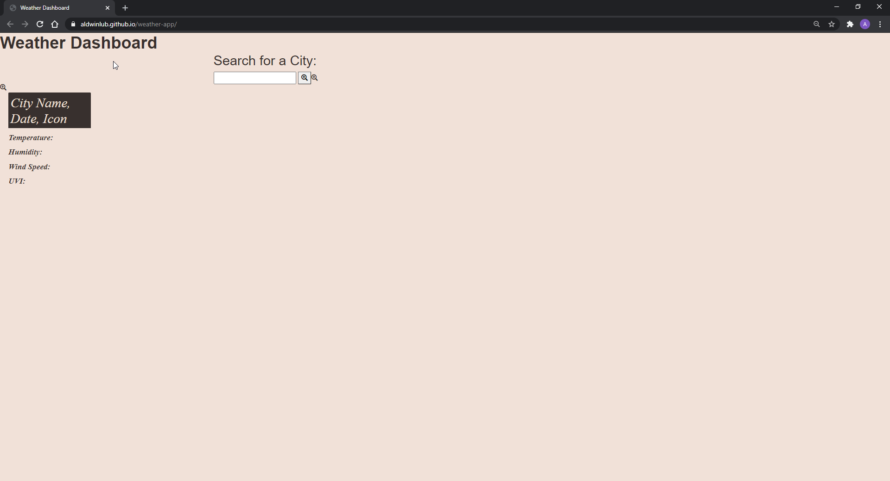
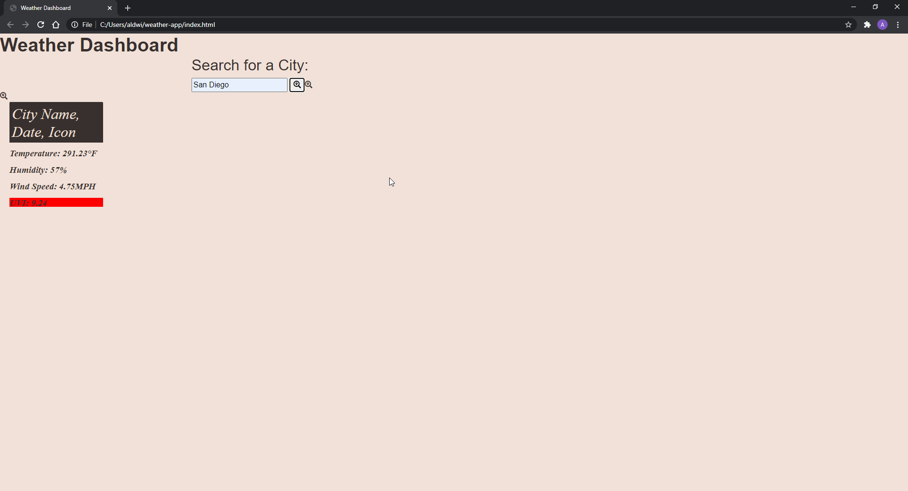
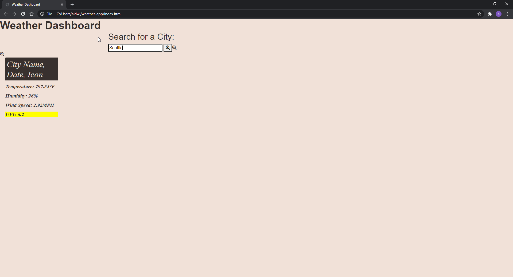

# weather-app

## An Overview:

This weather app allows the user to type in a major city into the input bar and, with the click of a button or submit. With the help of the weatheropen API, the user would be able to see the city's current temperature, humidity, wind speed, and UVI level. The UVI levels would also be color-coded as red, yellow, and green for a severe, moderate, and favorable condition depending on how high or low the levels are.

On the flip side, I was unable to correctly use the moment.js unix code to correctly display the time nor display actual buttons onto the page. The 5 day forcast and displaying their respected icons were also big blocks in my path. Hopefully I can go back and fully edit this project.

## Link to GitHub Pages:

https://aldwinlub.github.io/weather-app/

## Screenshots:

San Diego:

Seattle:

New York City:
